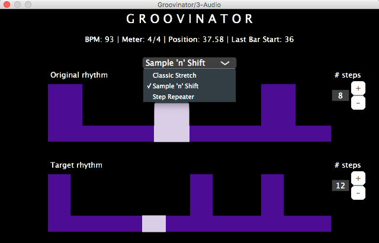

# Groovinator

The Groovinator is an audio plugin, available in VST and AU format, that performs real-time playhead-aware rhythm modification. Currently supported modification modes are: Classic Stretch, Sample 'n' Shift, and Step Repeater.

Developed using the [JUCE](https://github.com/WeAreROLI/JUCE) framework in addition to Olli Parviainen's [SoundTouch](https://www.surina.net/soundtouch/) library and Sergio Castro's [implementation](https://bitbucket.org/sjcastroe/bjorklunds-algorithm) of Bjorklund's algorithm.